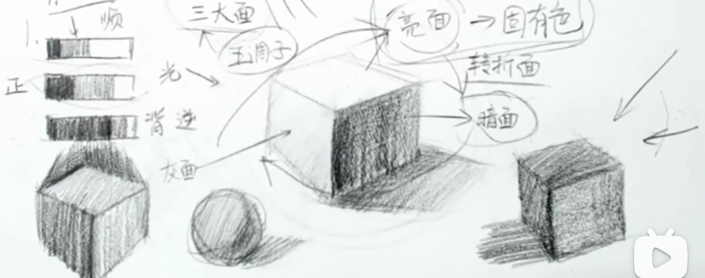

# 素描入门

## 一、工具

### 铅笔的种类及运用

| 类型 | 2H   | HB   | 2B   | 4B   | 6B   | 8B   | 10B  | 12B  |
| ---- | ---- | ---- | ---- | ---- | ---- | ---- | ---- | ---- |
| 类别 | 硬铅 | 硬铅 | 中铅 | 中铅 | 软铅 | 软铅 | 软铅 | 软铅 |

- H为hard，表示硬；B为black，表示黑
- 有单数B，但是没有必要使用
- 软铅颗粒大，不紧实，最黑；硬铅颗粒小，紧实，最不黑

## 二、排线

### 划线方法

1. 运腕法，大面积
2. 小拇指支撑运腕法，小面积
3. 运臂法，起型
4. 穷字法

## 三、三大面

亮面、灰面、暗面

## 四、五调子

高光、亮灰面、明暗交界线、反光、投影

## 五、透视

视频线：和视线平行的线

消失点：一点透视、两点透视

